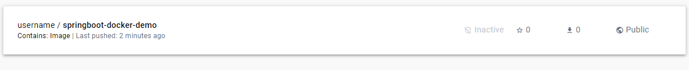

### Run this command in terminal to build a docker image

<code>
docker build -t springboot-docker-demo .
</code>

### To check all images created by docker run this command in terminal

<code>
docker images
</code>

### To run the image from Dockerfile write this command with {local-machine-host-port}:{docker-container-port}
<em>Notice how we reuse docker image tag name we defined in the first command with <strong>-t</strong></em>

<code>
docker run -p 8080:8080 springboot-docker-demo
</code>

### Use this command to check running containers and info on them

<code>
docker ps
</code>

<em>Here how it looks when no docker container is running</em>

<em>Now running the same command after a docker container is already running</em>

<em>To stop a container we can use a shortcut of keys</em> <strong>Ctrl + C</strong> <em>in the terminal where we run
the container</em>

### To run container in detached mode (meaning it will run in the background not in the terminal) use this command

<code>
docker run -p 8080:8080 -d springboot-docker-demo
</code>

<em>Notice how we added -d flag which enables detached mode. In the image you see terminal output of container id.</em>

### To see the logs of this container you can use this command

<em>Notice how we can use first part of the container id and it show logs of our spring boot application</em>

<code>
docker logs -f 27f95
</code>

### To access endpoints in this example we have /docker REST API end-point we can try opening it via browser

<code>
http://localhost:8080/docker
</code>

<em>We can see the output as a basic html page with the message which we defined in DockerController.java class /docker
GET endpoint</em>

### To stop a docker container you can use this command
<em>Notice how we can use first part of the container id and it show logs of our spring boot application</em>

<code>
docker stop 27f95
</code>

<em>Here we see that docker stop command was successful</em>

<em>Here we can see that the container is stopped by running docker ps command</em>

### Publishing docker image to docker-hub

1. Login to docker via terminal or Docker Desktop application

<code>
docker login
</code>

<em>Here you have to enter your docker hub login and password</em>

2. Choose the image tag , you can use docker images command to check available images

<code>
docker images
</code>

<em>Choose image by repository, in this example we will use springboot-docker-demo image</em>

3. Then run this command to create a local repository with image, where docker-id is your username in docker hub with tag

<code>
docker tag springboot-docker-demo {docker-id}/springboot-docker-demo:0.1.RELEASE
</code>

<em>Now you can check if repository is created with defined release tag via docker images command</em>

4. Now we need to push the image to docker hub using this command

<em>It can take some time 5-20 seconds to push the image to docker hub repository</em>

<code>
docker push {docker-id}/springboot-docker-demo:0.1.RELEASE
</code>

5. We should be able to see our image via https://hub.docker.com/repositories/username

### Pulling the docker image

<em>Notice how in response we see docker pull command using default tag latest and return an error manifest unknown</em>

<code>
docker pull {docker-id}/springboot-docker-demo
</code>

<code>
$ docker pull username/springboot-docker-demo 
Using default tag: latest 
Error response from daemon: manifest for username/springboot-docker-demo:latest not found: manifest unknown: manifest unknown
</code>

<em>This happens because in our example we defined a tag 0.1.RELEASE, in order to pull this exact version of image
we must define a tag in our command</em>

<code>
docker pull {docker-id}/springboot-docker-demo:0.1.RELEASE
</code>

<em>Notice how when we pull the image we see that Image is up to date this is because we already have it locally</em>

<code>
$ docker pull username/springboot-docker-demo:0.1.RELEASE 
0.1.RELEASE: Pulling from username/springboot-docker-demo 
Digest: sha256:86dafb72c9f8963af9d9b43e274a25fa7575be68b07b3f1d5fad4bd3e79c53fa 
Status: Image is up to date for username/springboot-docker-demo:0.1.RELEASE 
docker.io/username/springboot-docker-demo:0.1.RELEASE
</code>

<strong>You can try pulling a different image using these commands e.g. mysql image and then check if it was fetched</strong>

<code>
docker pull mysql:latest
</code>

<em>and check if it is fetched with this command</em>

<code>
docker images
</code>

<strong>You can try running this image by running this image and checking logs of the container</strong>

<em>Notice we use -p flag to define ports , --name option to name the container , -e flag to define env variables ,
-d flag to run in detached mode and image:tag to choose image to run</em>

<code>
docker run -p 3307:3306 --name localhost -e MYSQL_ROOT_PASSWORD=your_root_password -e MYSQL_DATABASE=your_db
-e MYSQL_USER=your_user -e MYSQL_PASSWORD=your_password -d mysql:latest
</code>

<em>Now to check logs of this image we can run this command we used before</em>

<code>
docker logs -f localhost
</code>

<em>We can exit logs of the container using Ctrl + C</em>

<em>To access bash terminal inside the container we can use this command/em>

<code>
docker exec -it localhost bash
</code>

<em>To access mysql inside of bash we can run this command, then enter password and press Enter</em>

<code>
mysql -u root -p
</code>

<em>Now inside mysql cli we can run this command to check if everything works correctly</em>

<code>
show databases
</code>

### Create a docker network

<em>In order to communicate one container with another container we have to deploy them in same Docker network</em>

<em>To create a network write this command where after create you define network name</em>

<code>
docker network create springboot-mysql-net
</code>

<em>On success we'll see docker network id</em>

<code>
docker network ls
</code>

<em>Here we check if docker network is created, you will see all available docker networks here</em>
<em>Notice how the driver is bridge it means that containers in this network are able to communicate with each other</em>

### Running an image in docker container network

<em>Use this command to run an image in docker container network we created</em>

<code>
docker run --name mysqldb --network springboot-mysql-net -e MYSQL_ROOT_PASSWORD=root -e MYSQL_DATABASE=employeedb -d mysql
</code>

<em>To check running docker containers use this command</em>

<code>
docker ps
</code>

